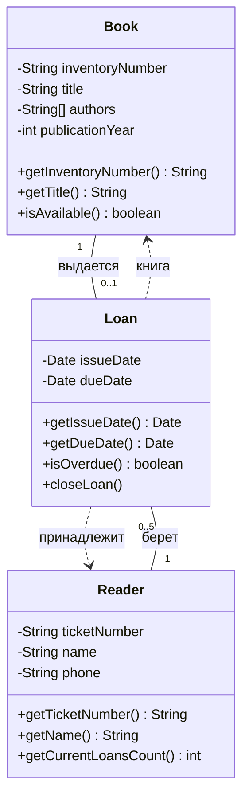

giПрактическое задание 1 (UML)

```mermaid
classDiagram
    class Book {
        -String inventoryNumber
        -String title
        -String[] authors
        -int publicationYear
        +getInventoryNumber() String
        +getTitle() String
        +isAvailable() boolean
    }

    class Reader {
        -String ticketNumber
        -String name
        -String phone
        +getTicketNumber() String
        +getName() String
        +getCurrentLoansCount() int
    }

    class Loan {
        -Date issueDate
        -Date dueDate
        +getIssueDate() Date
        +getDueDate() Date
        +isOverdue() boolean
        +closeLoan()
    }

    Reader "1" -- "0..5" Loan : берет
    Book "1" -- "0..1" Loan : выдается
    Loan ..>  Reader : принадлежит
    Loan ..>  Book : книга
```

