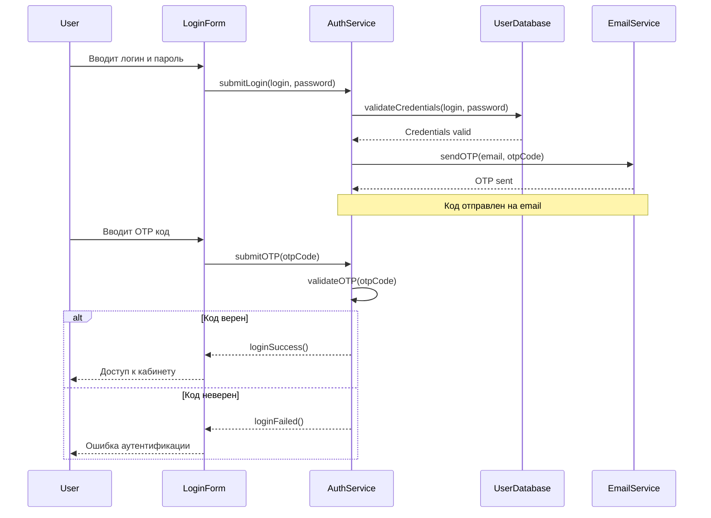

Практическое задание 1 (UML)

```mermaid
sequenceDiagram
    participant U as User
    participant LF as LoginForm
    participant AS as AuthService
    participant UD as UserDatabase
    participant ES as EmailService

    U->>LF: Вводит логин и пароль
    LF->>AS: submitLogin(login, password)
    AS->>UD: validateCredentials(login, password)
    UD-->>AS: Credentials valid
    AS->>ES: sendOTP(email, otpCode)
    ES-->>AS: OTP sent
    Note over AS,ES: Код отправлен на email
    U->>LF: Вводит OTP код
    LF->>AS: submitOTP(otpCode)
    AS->>AS: validateOTP(otpCode)
    alt Код верен
        AS-->>LF: loginSuccess()
        LF-->>U: Доступ к кабинету
    else Код неверен
        AS-->>LF: loginFailed()
        LF-->>U: Ошибка аутентификации
    end
```

